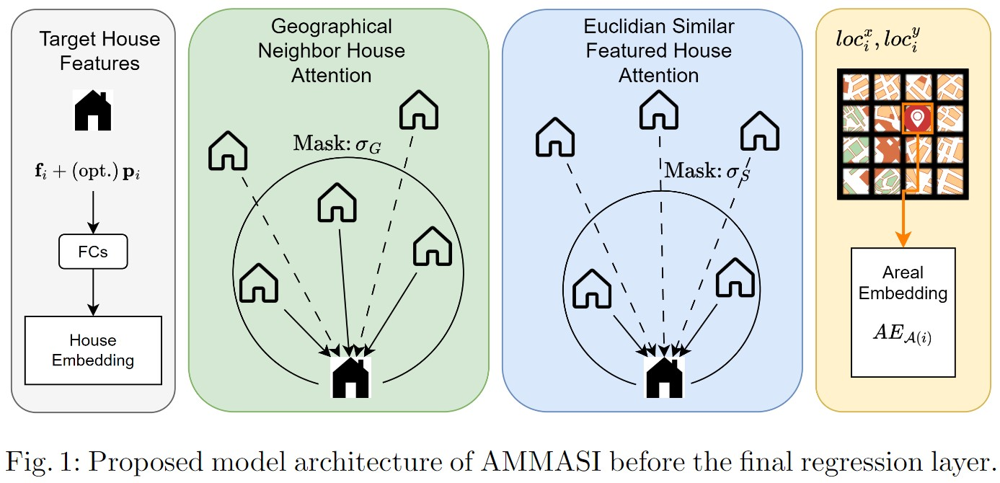
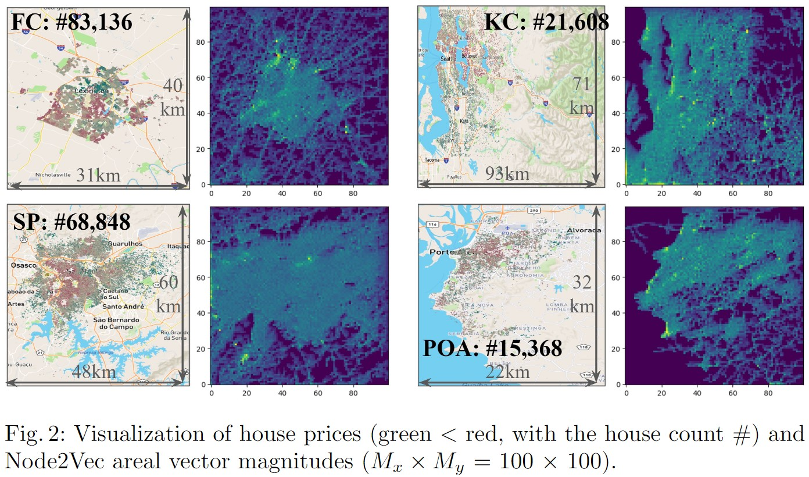
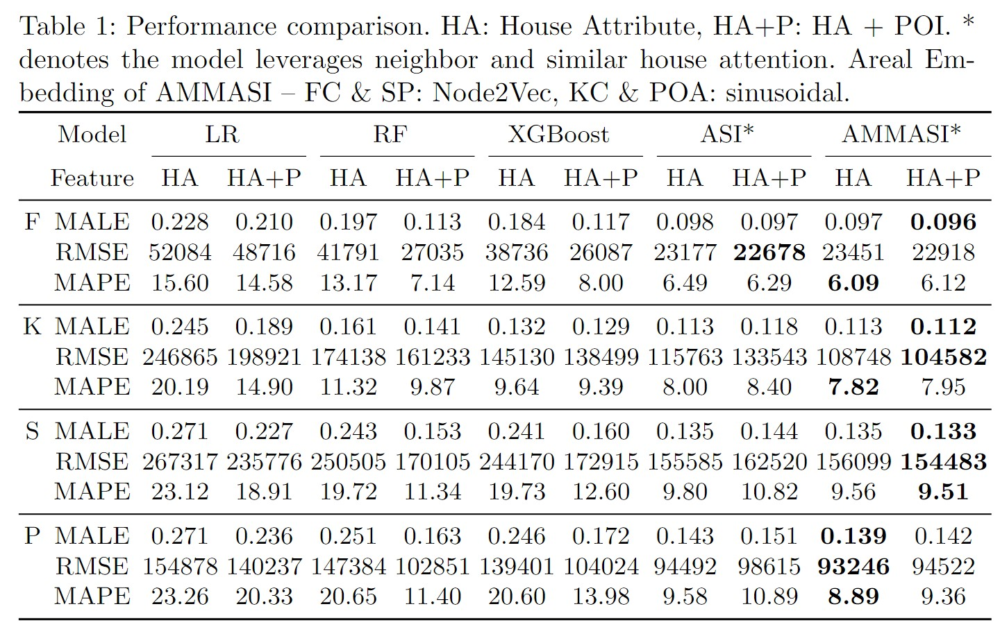
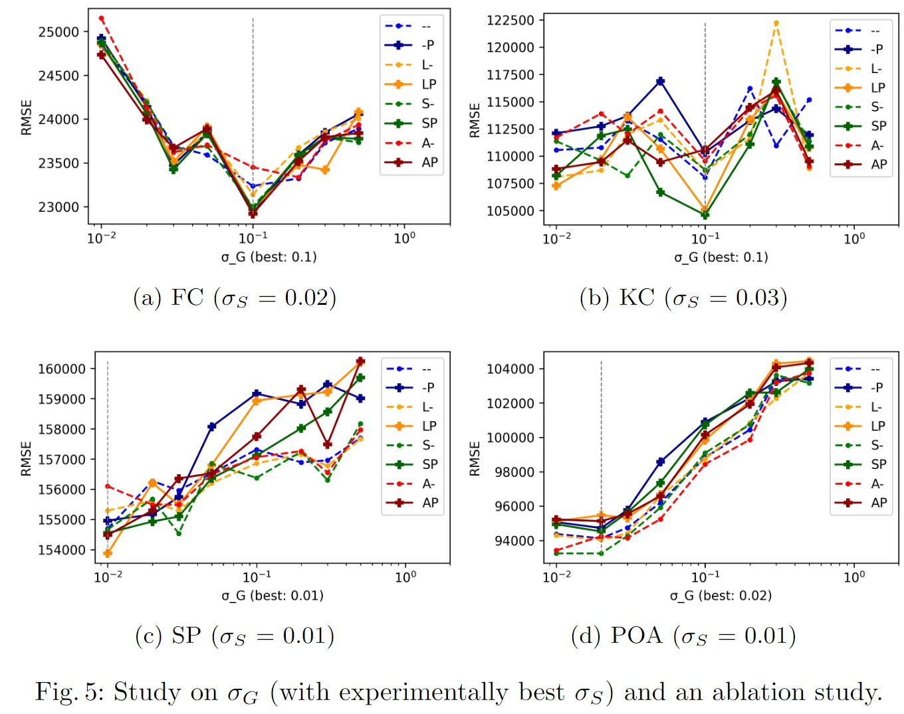
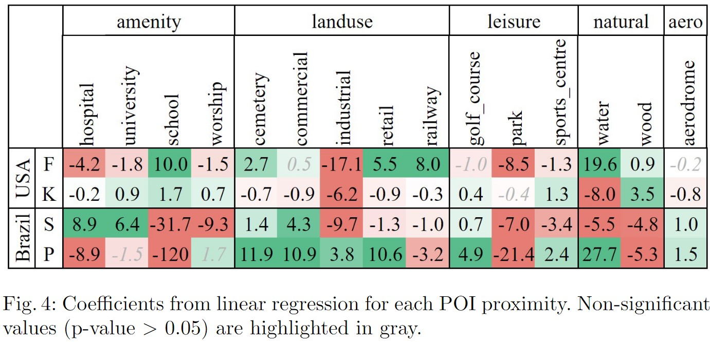

# Execution Manual for AMMASI

## Overview

The **Areal Embedding-based Masked Multihead Attention-based Spatial Interpolation (AMMASI)** is a cutting-edge framework aimed at predicting house prices by employing advanced spatial interpolation techniques. Building on the foundational work of [ASI](https://github.com/darniton/ASI/) as presented by Viana et al. (2021), this repository introduces significant enhancements through the integration of masked multihead attention mechanisms.

This document elucidates the necessary procedures for setting up, executing, and interpreting the functionalities embedded in the AMMASI repository. Researchers and practitioners are encouraged to adhere meticulously to the prescribed steps to ensure fidelity to the intended experimental protocols.

---

## Prerequisites

### System Requirements

- **Operating System:** Linux, macOS, or Windows (preferably Unix-based for compatibility).
- **Memory:** Minimum of 8 GB RAM (16 GB recommended).
- **Processor:** Multi-core processor (preferably with GPU support for enhanced computation).
- **Disk Space:** At least 10 GB of free disk space.

### Software Dependencies

The repository leverages Python-based deep learning frameworks and spatial analysis tools. Prior to execution, ensure that the following dependencies are installed:

1. **Python Version**: Python 3.8 or above.
2. **Required Libraries**:
   - `numpy`
   - `pandas`
   - `torch`
   - `torchvision`
   - `scikit-learn`
   - `matplotlib`
   - `seaborn`
   - `tqdm`

### Hardware Acceleration

For optimal performance, it is highly recommended to execute this framework on a system equipped with:

- **GPU**: NVIDIA GPUs with CUDA support.
- **CUDA Toolkit**: Version 11.0 or higher.

---

## Directory Structure

Upon extraction, the repository manifests the following directory structure:

```
AMMASI-main/
|-- asi_norm
|-- datasets
|-- figs
|-- mycode
|-- notebooks
|-- README.md
|-- train_model_norm.py
```

### Key Directories and Files

1. **`asi_norm/`**: Contains preprocessed datasets and normalization scripts.
2. **`datasets/`**: Stores raw and prepared datasets.
3. **`figs/`**: Includes visualizations and experimental results.
4. **`mycode/`**: Houses implementation scripts and utility functions.
5. **`notebooks/`**: Jupyter notebooks for exploratory data analysis and experimentation.
6. **`train_model_norm.py`**: The main script to train the AMMASI model.

---

## Execution Steps

### Step 1: Clone the Repository

To initiate the process, clone the repository from the source or place the provided zip file into your working directory.

```bash
# Clone via GitHub
git clone <repository-url>
cd AMMASI-main
```

### Step 2: Environment Setup

Establish a Python virtual environment to avoid dependency conflicts:

```bash
# Create and activate a virtual environment
python3 -m venv ammasi_env
source ammasi_env/bin/activate

# Install dependencies
pip install -r requirements.txt
```

If the `requirements.txt` file is unavailable, manually install dependencies:

```bash
pip install numpy pandas torch torchvision scikit-learn matplotlib seaborn tqdm
```

### Step 3: Dataset Preparation

Ensure that the dataset files are placed under the `datasets/` directory. The original dataset can be accessed from the [ASI repository](https://github.com/darniton/ASI/).

#### Normalize the Dataset
Use scripts in the `asi_norm/` directory to normalize data as required.

```bash
# Example normalization command
python asi_norm/normalize.py --input datasets/raw_data.csv --output datasets/normalized_data.csv
```

### Step 4: Model Training

Execute the main training script to initiate the model training process:

```bash
python train_model_norm.py --config config.json
```

#### Key Arguments:

- `--config`: Path to the configuration file specifying hyperparameters and dataset details.
- `--gpu`: Enable GPU-based acceleration (default: `True`).

### Step 5: Evaluation and Visualization

Post-training, the results can be evaluated and visualized using the scripts provided in the `notebooks/` directory. Open a Jupyter notebook environment to explore the results interactively:

```bash
# Start Jupyter Notebook
jupyter notebook

# Navigate to notebooks/ for evaluation scripts
```

---

## Interpretation of Results

The `figs/` directory contains graphical representations of the model’s performance, including:

1. **Performance Comparison**: Benchmark metrics against the baseline ASI model.
2. **Areal Embedding Visualizations**: Intuitive depictions of the areal embedding process.
3. **Loss Curves**: Training and validation loss plots to assess model convergence.

---

## Troubleshooting

1. **Dependency Issues**:
   - Verify Python version compatibility.
   - Check for missing libraries and install as necessary.

2. **Dataset Not Found**:
   - Ensure the dataset is placed in the `datasets/` directory.
   - Confirm the dataset file paths in the configuration file.

3. **Performance Degradation**:
   - Validate hardware acceleration using the `torch.cuda.is_available()` function.
   - Experiment with hyperparameters in `config.json`.

---

## Citation

If you use this repository in your research, kindly cite:

```
@article{viana2021asi,
  title={ASI: Areal Spatial Interpolation for House Price Prediction},
  author={Viana, Author},
  year={2021}
}
```

---

## Acknowledgments

This repository draws inspiration from the original ASI framework. We extend our gratitude to the authors for their foundational work.


# AMMASI
Areal embedding based Masked Multihead Attention-based Spatial Interpolation for House Price Prediction



Improved on top of [ASI](https://github.com/darniton/ASI/) [Viana2021].

# Dataset



Original data is uploaded in [ASI](https://github.com/darniton/ASI/).


# Experimental Result of AMMASI




## Results of ASI
* ASI with HA is the result from [Viana2021]
* ASI with HA+P is the result recorded in notebooks/{dname}/Training-norm.ipynb

※ The file name 'norm' has nothing to do with poi. Sorry for confusion.

In asi_norm/input_dataset.py (line 49): 
```
    def __call__(self):

        assert isinstance(self.id_dataset, object)

        data = np.load(PATH + '/datasets/'+ self.id_dataset + '/data_poi.npz', allow_pickle=True)

```

## Results of AMMASI

* Full results are reported in *mycode/prediction/make_table-AMMASI.ipynb*
* You can also check *mycode/test_logs* for the full experiment logs.
* You can also refer to ablation study (Fig.5).




## Parameter and Ablation Test





# References

[Viana2021] Viana, Darniton, and Luciano Barbosa. "Attention-based spatial interpolation for house price prediction." Proceedings of the 29th International Conference on Advances in Geographic Information Systems. 2021.
